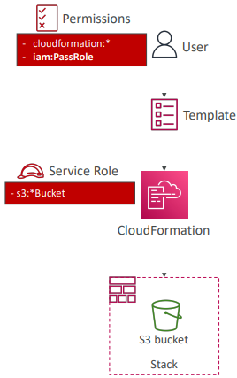

# AWS Integration and Messaging

## SQS

<figure><figcaption>
synchronous apps may not perform well w variabale workloads, decouple to scale independently
</figcaption></figure>

<figure><figcaption>
unlimited throughput, 256kb message limit, duplicates and out of order messages (SendMessageAPI)
</figcaption></figure>

Can use CloudWatch metric to trigger autoscaling of EC2 'Consumers'

### SQS Security

Encryption: In-flight HTTPS API, at-rest KMS, client-side as per clients choice

Access Controls: IAM policies regulate access to SQS API

SQS Access Policies (Similar to S3): Cross-account access to queue, allow other services to write to queue

### Visibility Timeout

30 seconds default, once consumer polls a message not visible to others till timeout over after which it becomes available again in SQS if not deleted\
Consumer can call **ChangeMessageVisibility** API to get more time.

Long Polling - Consumer wait in between 'polls' if there are no messages in queue (20 sec preferred) via **WaitTimeSeconds**

### FIFO Queue (Ordering Messages)

300 msg wo batching, 3000 w. No duplicates

<figure><figcaption>
decoupling bw application tiers
</figcaption></figure>

## SNS (Notification) Pub/Sub

Receivers (Subscriptions) listen to Topics. One topic max 12.5 mil subs, One sub max 100k topics\
Integrate many AWS services w SNS for notifications

Publish to SNS via Topic Publish (SDK) or DIrect Publish (Mobile SDK)

Same security policies as SQS

### SNS+SQS: Fan Out&#x20;

<figure><figcaption>
Easily manage SQS instead of manual config, fully decoupled, cross-region delivery
</figcaption></figure>

#### SNS FIFO - Ordering (Message Group ID) and Deduplication (Dedup ID)

Can have Standard and FIFO SQS as subscribers

Use FIFO too in above figure for ordering + deduplication

<figure><figcaption>
Use JSON policy to filter messages sent to subscriptions
</figcaption></figure>

