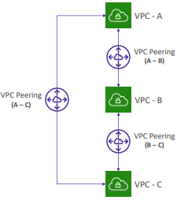

# Other Services

## CloudFormation

Creates configurations on demand as per user requirements, you already know that

Infrastructure as Code (IaC) - Sec+ terms, can modify our infra on the fly and automated diagrams generated for templates

CloudFormation + Application Composer - ultimate duo

<figure><figcaption>
CF as a service, check the role it has - users can create/update/delete resources on request
</figcaption></figure>

## Simple Email Service (SES)

Fully managed service to send emails, allow inbound/outbound emails

Supports DKIM and SPF, flexible IPs available - sent via AWS Console, API or SMTP

For transactional, marketing and bulk email communications

## Pinpoint

2-way (outbound/inbound) marketing communications service - supports SMS, voice and app messaging upto billions of messages per day

Personalize messages for different customers

SNS and SES used to manage message audience and delivery whereas this focuses more on the content of the message itself

## Systems Manager

### SSM Session Manager

Start shell on EC2 **without port 22, SSH, bastion or SSH keys**&#x20;

### Run Command

Execute scripts or commands without SSH, pipe output to AWS Console, S3 or whatever you want

### Patch Manager

Automates patching managed instances, on-demand or using a schedule called 'Maintenance Windows'

### Automation

For maintenance and deployment of AWS resources

'Automation Runbook' used to define actions to be performed and is called upon by the stuff

<figure><figcaption></figcaption></figure>

## Cost Explorer

Visualize, understand, and manage your AWS costs and usage over time\
Choose optimal Savings plan, forecast usage upto 12 months based on previous data

## Cost Anomaly Detection

Continuously monitor your cost and usage using ML to detect unusual spends

## AWS Batch

Fully managed batch processing at any scale upto 100,000 jobs

These jobs are not continuous (has start and end) and defined as Docker images which run on ECS

<figure><figcaption></figcaption></figure>

## AppFlow

Securely transfer data between Software-as-a-Service (SaaS) applications and AWS

• Sources: Salesforce, SAP, Zendesk, Slack, and ServiceNow \
• Destinations: AWS services like Amazon S3, Amazon Redshift or non-AWS such as  SnowFlake and Salesforce \
• Frequency: on a schedule, in response to events, or on demand \
• Data transformation capabilities like filtering and validation \
• Encrypted over the public internet or privately over AWS PrivateLink \
• Don’t spend time writing the integrations and leverage APIs immediately

## Amplify

Helps develop and deploy full stack web and mobile applications

<figure><figcaption></figcaption></figure>

