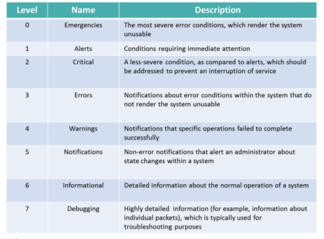

# Network Management and Tools

### Network Logging

Syslog: Routers, switches and servers send all to this one place

Microsoft has an EVENT VIEWER to view logs

* Application: info on apps running
* Security: security of client or server
* System: info on operating system events

## Tools

Cable Certifier: To determine its category (CAT3,CAT5 etc)

Butt Set: Used for telephone to check for dial tone

OTDR: Optical, locate breaks in cables and estimate severity and distance to break

Throughput Tester: To observe how network perform under heavy load

Bit Error Rate Tester (BERT): Generate pattern at one end of link and analyze pattern, used for troubleshooting interferences on cable

Wireless Analyzer: Survey wide area to ensure proper coverage

Protocol Analyzer: Traffic captured from network and reviewed, also called network sniffer
