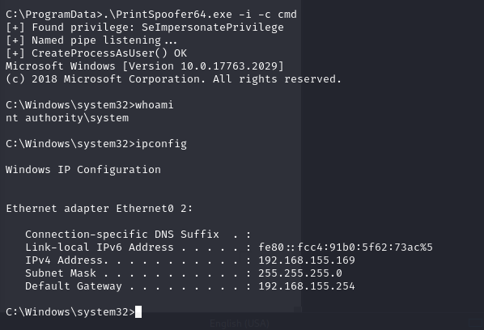

# Relia

## Report

<figure><figcaption></figcaption></figure>

## Domain Users

```
Administrator            andrea                   anna                     
brad                     dan                      Guest                    
iis_service              internaladmin            jenny                    
jim                      krbtgt                   larry                    
maildmz                  michelle                 milana                   
mountuser 

maildmz@relia.com:DPuBT9tGCBrTbR
jim:Castello1!
michelle:NotMyPassword0k?
andrea:PasswordPassword_6
```


192.168.139.250

Challenge 2 - WINPREP OS Credentials:

```
offsec / lab
```

**External subnet**

192.168.139.245-250 & 189,91

**Internal**

172.16.99.6-7, 14-15, 19-21, 30

## Chain Attack Flow

* Look for the ftp low hanging fruit first
* HTTP/S websites
* SMB/RPC


```
SMB         192.168.139.248 445    EXTERNAL         [+] EXTERNAL\guest: 
```


## Proof

Only Demo proof (port forward) and mail (proof) left

```
.189 - proof only
.191 - proof only
.245 - local and proof
.246 - local and proof
.247 - local and proof
.248 - local and proof
.249 - local and proof
.250 - NONE (WINPREP machine)

.6 - proof only
.7 - local and proof
.14 - local and proof 
.15 - local and proof
.19 - local and proof
.20 - local and proof
.21 - proof only
.30 - proof only
```

## Flags

```
WEB01 - local.txt
```

## Enumeration \[Not Machine Specific]

```
for p in {ftp,mssql,rdp,wmi,ldap,smb,winrm}; do nxc $p 192.168.113.169-171 -u Eric.Wallows -p 'EricLikesRunning800' ; done
for p in {rdp,wmi,smb,winrm}; do nxc $p winternal -u michelle -p 'NotMyPassword0k?' ; done 
```

## Learn

* Yep, that is exactly what it is, and what I suspected. PrivateTmp will create a `systemd-private-<string>-apache2.service` in `/tmp` and `/var/tmp` in there those paths will be isolated from the rest of the system for the Apache service. However, `/dev/shm` is unaffected by privatetemp, so that is why you are able to upload your shell there
* nxc guest enumeration throughout and specific users and LOG IT HERE
* Procmon - It should be discussed in the "Windows Privilege Escalation" category, under "Leveraging Windows Services - DLL Hijacking".
* rlwrap is absolutely mega, good job on ligolo, port forwarding and other concepts we learnt prior&#x20;
* The real test starts next year with OSCP A, Merry Christmas and Happy Holidays!
